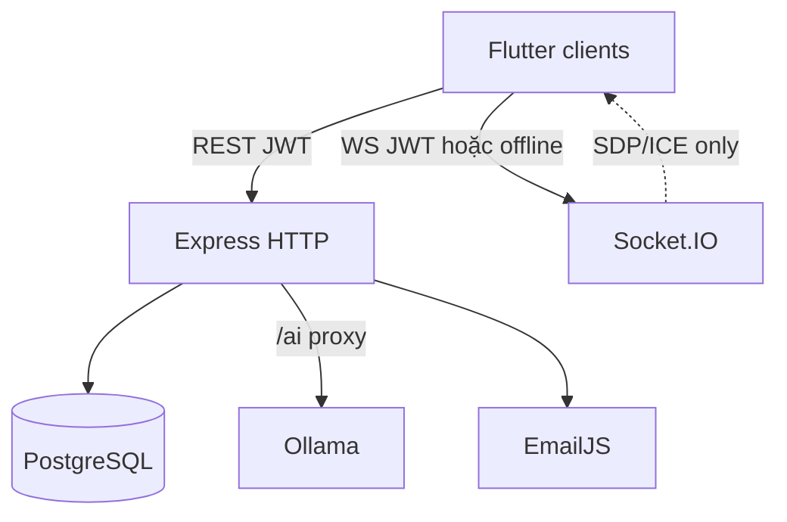
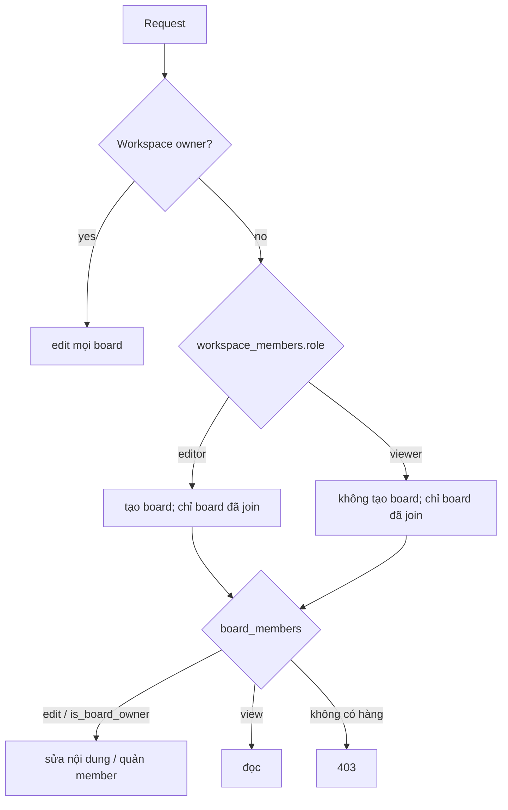

# Architecture — PeerTask Server

Express + PostgreSQL + Socket.IO. Repo này là API và signaling. Canvas render và CRDT apply nằm ở client.

## 1. Bối cảnh



Một process: `http.Server` + `express` + `socket.io` (`src/index.js`).

## 2. Việc server đảm nhận

| Có | Không |
| --- | --- |
| User, JWT, refresh row | Prefix `/api` |
| Workspace / board / task / invite | Render stroke |
| `board_operations` catch-up | Relay toàn bộ board JSON qua socket |
| Signaling room + offline room | Persist cursor |
| Proxy Ollama `/ai/*` | Horizontal room store (in-memory only) |

README cũ ghi “server không store board state” — **sai với code hiện tại**. Task và operation log **có** lưu Postgres.

## 3. Cấu trúc `src/`

```
src/
├── index.js                 mount + listen
├── db/pool.js               pg Pool, DATABASE_URL
├── db/migrate.js            schema nền
├── db/migrations/           cột task bổ sung
├── middleware/
│   ├── auth.js              Bearer JWT
│   ├── permissions.js       workspace / board / task
│   └── errorHandler.js      AppError, asyncHandler
├── routes/                  auth, refresh, workspaces, boards, tasks, operations, ai, admin
├── sockets/signaling.js
└── services/email_service.js
```

CommonJS. SQL parameterized `$1`, `$2`.

## 4. HTTP

**Không** mount `/api`.

| Prefix | File |
| --- | --- |
| `/auth` | `routes/auth.js` |
| `/token` | `routes/refresh.js` |
| `/workspaces` | `workspaces.js` + `workspace_members.js` |
| `/boards` | `boards.js` + `board_members.js` |
| `/tasks` | `tasks.js` |
| `/operations` | `operations.js` |
| `/admin` | `admin.js` |
| `/ai` | `ai.js` |
| `/health` | inline |

Public: register, login, forgot/reset, `/token/refresh`, `/token/logout`, `/health`, `/ai/*`, GET invite info.

Còn lại: `authenticateToken` rồi middleware quyền.

Lỗi chuẩn:

```json
{ "success": false, "error": { "message": "...", "code": "FORBIDDEN", "statusCode": 403 } }
```

Một số route cũ vẫn `{ error: "string" }` — route mới phải `AppError`.

## 5. Auth

- Access ~1h, refresh 7 ngày, cả hai `jwt.sign(..., JWT_SECRET)`.
- Payload `{ id, email }`; refresh có `type: 'refresh'`.
- Refresh lưu `refresh_tokens` (`revoked`, `expires_at`).
- Socket: `handshake.auth.token`. Không token → `isOfflineMode`. Token sai → reject (online).

## 6. Quyền



Helpers: `requireWorkspaceOwner|Editor|Member`, `requireBoardView|Edit|Owner|Editor`, `requireTaskEdit`.

ID: `params.boardId || params.id || body.boardId` (tương tự workspace). Route mới phải để id đúng chỗ này.

Assignee: phải là board member hoặc workspace owner (`validateAssignees`).

## 7. Schema (rút gọn)

| Bảng | Vai trò |
| --- | --- |
| `users` | email, password_hash, name, avatar |
| `refresh_tokens` / `password_reset_tokens` | phiên / reset |
| `workspaces` / `workspace_members` / `workspace_invites` | tổ chức + invite |
| `boards` / `board_members` | board + `permission` + `is_board_owner` |
| `tasks` | Kanban; `assignees UUID[]`; status/priority; `parent_id`; labels jsonb |
| `strokes` | legacy strokes table |
| `board_operations` | `operation_id` unique, `operation_type`, `payload` jsonb, `timestamp` bigint |

Baseline: `migrate.js`. Cột task thêm: `migrations/add_task_fields.js` — phải chạy trên DB cũ.

Enums: status `todo|doing|done`; priority `low|medium|high|urgent`; op `createObject|updateObject|deleteObject|moveObject|resizeObject`.

`GET /operations/board/:id` map sang shape Dart: `{ opId, actor, timestamp, type, payload, applied: false }`. Trùng `operationId` khi POST → 200 already exists.

## 8. Signaling

In-memory: `rooms`, `socketToRoom`, `socketToUser`, `socketToUserInfo`, `offlineRooms`.

**Online:** `join_room(boardId string)` → `room_joined` + `peer_joined`; `signal`; `update_mic_status`; `leave_room` / disconnect → `peer_left`.

**Offline:** `create_room` / `join_room` `{ roomCode, userName }`; join `offline_${roomCode}`; xóa map khi hết user.

Restart process = mất room. Scale nhiều instance cần adapter (chưa có).

## 9. AI

`OLLAMA_URL` mặc định `http://localhost:11434`.

`GET /ai/health`, `/ai/tags` · `POST /ai/generate`, `/ai/generate/stream`, `/ai/chat`.

Hiện không bắt JWT. Coi là mặt mở khi deploy public.

## 10. Quyết định đã chốt

| Quyết định | Lý do |
| --- | --- |
| Không `/api` | Khớp `index.js` + Flutter `ApiService` |
| Một `JWT_SECRET` | Đúng code; đừng thêm secret thứ hai trừ khi migrate client |
| Operation log + P2P | Catch-up vs latency vẽ |
| In-memory rooms | Đơn giản; trade-off restart/scale |
| Permission trên server | Client không đáng tin |
